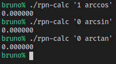
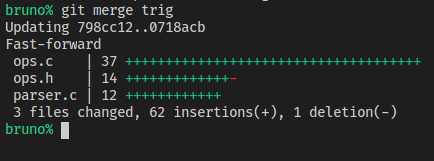
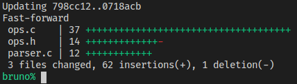

# Trabalhando Com _Branches_ (2)

Esse capítulo é a parte dois do exemplo de _branches_.

## Ainda No Computador Do Colega

O colega vai adicionar trigonometria inversa também:

Arquivo `ops.h`:
```C
 #define OP_COS_SYM "cos"
 #define OP_TAN_SYM "tan"
+#define OP_ARCSIN_SYM "arcsin"
+#define OP_ARCCOS_SYM "arccos"
+#define OP_ARCTAN_SYM "arctan"
     
 enum operation {
     op_add,
     op_sub,
     op_mul,
     op_div,
     op_sin,
     op_cos,
-    op_tan
+    op_tan,
+    op_arcsin,
+    op_arccos,
+    op_arctan
 };
```

Arquivo `ops.c`:
```C
 #include "ops.h"
+#include <math.h>

 int op_exec(enum operation op, struct stack **stack)
 {
...
             stack_push(stack, tan(left));
         }
         break;
+    case op_arcsin:
+        success = stack_pop(stack, &left);
+        if (success) {
+            stack_push(stack, asin(left));
+        }
+        break;
+    case op_arccos:
+        success = stack_pop(stack, &left);
+        if (success) {
+            stack_push(stack, acos(left));
+        }
+        break;
+    case op_arctan:
+        success = stack_pop(stack, &left);
+        if (success) {
+            stack_push(stack, atan(left));
+        }
+        break;
     }

     return success;
```

O colega vai ver se não ocorre algum erro de compilação (no Linux):
```sh
gcc -o ops.o -c ops.c
```
Perfeito, não ocorre.

Precisamos alterar o _parser_ também.

Arquivo `parser.c`:
```C
     } else if (advance_op(parser, OP_DIV_SYM, sizeof(OP_DIV_SYM))) {
         *output = op_div;
     } else if (advance_op(parser, OP_SIN_SYM, sizeof(OP_SIN_SYM))) {
         *output = op_sin;
     } else if (advance_op(parser, OP_COS_SYM, sizeof(OP_COS_SYM))) {
         *output = op_cos;
     } else if (advance_op(parser, OP_TAN_SYM, sizeof(OP_TAN_SYM))) {
         *output = op_tan;
+    } else if (advance_op(parser, OP_ARCSIN_SYM, sizeof(OP_ARCSIN_SYM))) {
+        *output = op_arcsin;
+    } else if (advance_op(parser, OP_ARCCOS_SYM, sizeof(OP_ARCCOS_SYM))) {
+        *output = op_arccos;
+    } else if (advance_op(parser, OP_ARCTAN_SYM, sizeof(OP_ARCTAN_SYM))) {
+        *output = op_arctan;
     } else {
         success = 0;
     }

     return success;
```

Vamos ver se não ocorre algum erro de compilação (no Linux):
```sh
gcc -o parser.o -c parser.c
```
Perfeito, não ocorre.

O colega vai testar também (precisa de `-lm`  para usar funções `math`):
```sh
gcc main.o parser.o stack.o ops.o -lm -o rpn-calc
```

Vamos fazer três testes: `1 arccos`, `0 arcsin`, e `0 arctan`, que devem
resultar em `0`, `0`, e `0` respectivamente.



Funciona! Agora ele pode subir as modificações:

```sh
git add .
git status
git commit -m 'implementada trigonometria inversa'
git push github trig
```

O colega está pronto, e vai mandar as mudanças pra _branch_ "_master_". Primeiro,
ele vai trocar para ela.
```sh
git checkout master
```

Após isso, ele vai checar se o repositório local está atualizado.
```sh
git pull github master
```


Ele está atualizado. Ele vai executar o `merge`.

```sh
git merge trig
```



Não é necessário resolver conflitos. O colega vai publicar as mudanças.

```sh
git push github master
```

## Voltando Para Nosso Computador

Temos que estar na _branch_ "_exp_". Vamos fazer mais uma mudança, vamos
adicionar logaritmos.

Arquivo `ops.h`:
```C
 #define OP_POW_SYM "^"
 #define OP_EXP_SYM "exp"
+#define OP_LOG_SYM "log"
+#define OP_LN_SYM "ln"
 
 enum operation {
     op_add,
     op_sub,
     op_mul,
     op_div,
     op_pow,
-    op_exp
+    op_exp,
+    op_log,
+    op_ln
 };
```

Depois, vamos implementar a execução dessas operações:

Arquivo `ops.c`:
```C
 #include "ops.h"
+#include <math.h>

 int op_exec(enum operation op, struct stack **stack)
 {
...
             stack_push(stack, exp(left));
         }
         break;
+    case op_log:
+        success = stack_pop(stack, &right) && stack_pop(stack, &left);
+        if (success) {
+            stack_push(stack, log(right) / log(left));
+        }
+        break;
+    case op_ln:
+        success = stack_pop(stack, &left);
+        if (success) {
+            stack_push(stack, log(left));
+        }
+        break;
     }

     return success;
```

Vamos ver se não ocorre algum erro de compilação (no Linux):
```sh
gcc -o ops.o -c ops.c
```
Perfeito, não ocorre.

Precisamos alterar o _parser_ também.

Arquivo `parser.c`:
```C
     } else if (advance_op(parser, OP_MUL_SYM, sizeof(OP_MUL_SYM))) {
        *output = op_mul;
     } else if (advance_op(parser, OP_DIV_SYM, sizeof(OP_DIV_SYM))) {
         *output = op_div;
     } else if (advance_op(parser, OP_POW_SYM, sizeof(OP_POW_SYM))) {
         *output = op_pow;
     } else if (advance_op(parser, OP_EXP_SYM, sizeof(OP_EXP_SYM))) {
         *output = op_exp;
+    } else if (advance_op(parser, OP_LOG_SYM, sizeof(OP_LOG_SYM))) {
+        *output = op_log;
+    } else if (advance_op(parser, OP_LN_SYM, sizeof(OP_LN_SYM))) {
+        *output = op_ln;
     } else {
         success = 0;
     }

     return success;
```

Vamos ver se não ocorre algum erro de compilação (no Linux):
```sh
gcc -o parser.o -c parser.c
```
Perfeito, não ocorre.


Vamos testar também (precisamos de `-lm`  para usar funções `math`):
```sh
gcc main.o parser.o stack.o ops.o -lm -o rpn-calc
```
Vamos fazer dois testes: `3 81 log`, e `2.718282 ln`, que devem resultar em `4`
e `1` respectivamente.


Funciona! Agora podemos subir as modificações:

```sh
git add .
git status
git commit -m 'implementado logaritmo'
git push github exp
```
Já podemos fazer `merge`.
```sh
git checkout master
```

Agora, vamos ver se não estamos desatualizados:
```sh
git pull github master
```



Ok, estávamos desatualizados, mas baixamos as atualizações. É possível que tenhamos
que resolver algum conflito. Vamos ver:
```sh
git merge exp
```


E... deu conflito. Resolveremos no próximo capítulo.
