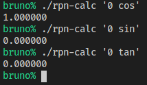

# Trabalhando Com _Branches_ (1)

Suponha que temos mais um colega no time. Suponha que ele decidiu
adicionar trigonometria. Suponha que nós decidimos adicionar exponenciação
e logaritmo. Para fazer tais tarefas, vamos criar mais duas _branches_, uma
chamada "_trig_", a outra chamada "_exp_".

## Nossa _Branch_

Para criá-la, e ao mesmo tempo mudar para ela:
```sh
git checkout -b exp
```

Vamos começar com exponenciação adicionando os identificadores das operações. Uma
exponenciação em qualquer base, e outra na base `e` (número de Euler). As linhas
marcadas com `-` no início serão excluídas, e as marcadas com `+` serão incluídas.

Arquivo `ops.h`:
```C
 #define OP_MUL_SYM "*"
 #define OP_DIV_SYM "/"
+#define OP_POW_SYM "^"
+#define OP_EXP_SYM "exp"
 
 enum operation {
     op_add,
     op_sub,
     op_mul,
-    op_div
+    op_div,
+    op_pow,
+    op_exp
 };
```

Depois, vamos implementar a execução dessas operações:

Arquivo `ops.c`:
```C
 #include "ops.h"
+#include <math.h>

 int op_exec(enum operation op, struct stack **stack)
 {
...
             stack_push(stack, left / right);
         }
         break;
+    case op_pow:
+        success = stack_pop(stack, &right) && stack_pop(stack, &left);
+        if (success) {
+            stack_push(stack, pow(left, right));
+        }
+        break;
+    case op_exp:
+        success = stack_pop(stack, &left);
+        if (success) {
+            stack_push(stack, exp(left));
+        }
+        break;
     }

     return success;
```

Vamos ver se não ocorre algum erro de compilação (no Linux):
```sh
gcc -o ops.o -c ops.c
```
Perfeito, não ocorre.

Precisamos alterar o _parser_ também.

Arquivo `parser.c`:
```C
     if (advance_op(parser, OP_ADD_SYM, sizeof(OP_ADD_SYM))) {
         *output = op_add;
     } else if (advance_op(parser, OP_SUB_SYM, sizeof(OP_SUB_SYM))) {
         *output = op_sub;
     } else if (advance_op(parser, OP_MUL_SYM, sizeof(OP_MUL_SYM))) {
        *output = op_mul;
     } else if (advance_op(parser, OP_DIV_SYM, sizeof(OP_DIV_SYM))) {
         *output = op_div;
+    } else if (advance_op(parser, OP_POW_SYM, sizeof(OP_POW_SYM))) {
+        *output = op_pow;
+    } else if (advance_op(parser, OP_EXP_SYM, sizeof(OP_EXP_SYM))) {
+        *output = op_exp;
     } else {
         success = 0;
     }

     return success;
```

Vamos ver se não ocorre algum erro de compilação (no Linux):
```sh
gcc -o parser.o -c parser.c
```
Perfeito, não ocorre.

Vamos testar também (precisamos de `-lm``  para usar funções `math`):
```sh
gcc main.o parser.o stack.o ops.o -lm -o rpn-calc
```

Vamos fazer dois testes: `3 4 ^`, e `1 exp`, que devem resultar em `81` e
`2.718282` respectivamente.


Funciona! Agora podemos subir as modificações:

```sh
git add .
git status
git commit -m 'implementada exponenciação'
git push github exp
```

## A _Branch_ Do Colega

Agora suponha que trocamos de computador, que somos o colega no computador
dele. A _HEAD_ deve estar na "_master_" a partir de agora (`git checkout master`).

Para criar a nova _branch_, e ao mesmo tempo mudar para ela:
```sh
git checkout -b trig
```

O colega vai adicionar as operações trignonométricas que quer adicionar. Vamos
começar pelas três funções mais conhecidas: `sin`, `cos`, `tan`.

Arquivo `ops.h`:
```C
 #define OP_MUL_SYM "*"
 #define OP_DIV_SYM "/"
+#define OP_SIN_SYM "sin"
+#define OP_COS_SYM "cos"
+#define OP_TAN_SYM "tan"
 
 enum operation {
     op_add,
     op_sub,
     op_mul,
-    op_div
+    op_div,
+    op_sin,
+    op_cos,
+    op_tan
 };
```

Arquivo `ops.c`:
```C
 #include "ops.h"
+#include <math.h>

 int op_exec(enum operation op, struct stack **stack)
 {
...
             stack_push(stack, left / right);
         }
         break;
+    case op_sin:
+        success = stack_pop(stack, &left);
+        if (success) {
+            stack_push(stack, sin(left));
+        }
+        break;
+    case op_cos:
+        success = stack_pop(stack, &left);
+        if (success) {
+            stack_push(stack, cos(left));
+        }
+        break;
+    case op_tan:
+        success = stack_pop(stack, &left);
+        if (success) {
+            stack_push(stack, tan(left));
+        }
+        break;
     }

     return success;
```

O colega vai ver se não ocorre algum erro de compilação (no Linux):
```sh
gcc -o ops.o -c ops.c
```
Perfeito, não ocorre.

Precisamos alterar o _parser_ também.

Arquivo `parser.c`:
```C
     if (advance_op(parser, OP_ADD_SYM, sizeof(OP_ADD_SYM))) {
         *output = op_add;
     } else if (advance_op(parser, OP_SUB_SYM, sizeof(OP_SUB_SYM))) {
         *output = op_sub;
     } else if (advance_op(parser, OP_MUL_SYM, sizeof(OP_MUL_SYM))) {
        *output = op_mul;
     } else if (advance_op(parser, OP_DIV_SYM, sizeof(OP_DIV_SYM))) {
         *output = op_div;
+    } else if (advance_op(parser, OP_SIN_SYM, sizeof(OP_SIN_SYM))) {
+        *output = op_sin;
+    } else if (advance_op(parser, OP_COS_SYM, sizeof(OP_COS_SYM))) {
+        *output = op_cos;
+    } else if (advance_op(parser, OP_TAN_SYM, sizeof(OP_TAN_SYM))) {
+        *output = op_tan;
     } else {
         success = 0;
     }

     return success;
```

Vamos ver se não ocorre algum erro de compilação (no Linux):
```sh
gcc -o parser.o -c parser.c
```
Perfeito, não ocorre.

O colega vai testar também (precisa de `-lm`  para usar funções `math`):
```sh
gcc main.o parser.o stack.o ops.o -lm -o rpn-calc
```

Vamos fazer três testes: `0 cos`, `0 sin`, e `0 tan`, que devem resultar em `1`,
`0`, e `0` respectivamente.



Funciona! Agora ele pode subir as modificações:

```sh
git add .
git status
git commit -m 'implementada trigonometria básica'
git push github trig
```
