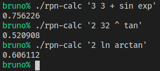

# Finalizando Com Um `Makefile`

Para finalizar, vamos melhorar nosso sistema de _build_ com um `Makefile`. Vamos
fazer uns testes também.

AVISO: este `Makefile` foi pensado para o Linux.

## Makefile

O programa `make` é um programa que visa automatizar (até um certo ponto) o
_build_ de um _software_, isto é, como ele é construído. Para isso,
especificamos o _build_ em um arquivo `Makefile`. Não está no escopo deste
tutorial ensinar `Makefile`, no entanto. Vou pedir para que aceite o arquivo
sem entendê-lo bem.

Arquivo `Makefile`:

```make
HEADERS = stack.h ops.h parser.h
CFLAGS = -g
LDFLAGS = -lm

rpn-calc: main.o stack.o ops.o parser.o
	$(CC) -o $@ $^ $(LDFLAGS)

%.o: %.c $(HEADERS)
	$(CC) -o $@ -c $< $(CFLAGS)

clean:
	$(RM) *.o rpn-calc
```

Agora, basta invocar o programa para construir (no terminal):
```sh
make
```

Compilou. Vamos publicar.
```sh
git add .
git status
git commit -m 'automatização do build'
git push
```


## Testes Mais Complexos

Vamos tentar:
* `3 3 + sin exp` = `exp (sin (3 + 3))`.
* `2 32 ^ tan` = `tan (2 ^ 32)`.
* `2 ln arctan` = `arctan (ln 2)`.

Resultado:


