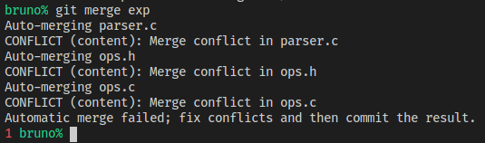

# Conflitos De Um _Merge_

Na nessa tentativa de _merge_, houve conflitos. Veja a mensagem:



Vamos olhar para os arquivos com os conflitos. Começaremos com `ops.h`:

```C
#ifndef OPS_H
#define OPS_H

#include "stack.h"

#define OP_ADD_SYM "+"
#define OP_SUB_SYM "-"
#define OP_MUL_SYM "*"
#define OP_DIV_SYM "/"
<<<<<<< HEAD
#define OP_SIN_SYM "sin"
#define OP_COS_SYM "cos"
#define OP_TAN_SYM "tan"
#define OP_ARCSIN_SYM "arcsin"
#define OP_ARCCOS_SYM "arccos"
#define OP_ARCTAN_SYM "arctan"
=======
#define OP_POW_SYM "^"
#define OP_EXP_SYM "exp"
#define OP_LOG_SYM "log"
#define OP_LN_SYM "ln"
>>>>>>> exp

enum operation {
    op_add,
    op_sub,
    op_mul,
    op_div,
<<<<<<< HEAD
    op_sin,
    op_cos,
    op_tan,
    op_arcsin,
    op_arccos,
    op_arctan
=======
    op_pow,
    op_exp,
    op_log,
    op_ln
>>>>>>> exp
};

int op_exec(enum operation op, struct stack **stack);

#endif
```

Atente para as linhas: `<<<<<<< HEAD`, `=======` e `>>>>>>> exp`. Tudo que está
entre `<<<<<<< HEAD` e `=======` é aquilo que nossa _HEAD_ introduziu (ou seja,
o que foi passado da _branch_ "trig" para a _branch_ "master"). Tudo entre
`=======` e `>>>>>>> exp` é o que a nossa _branch_ "exp" tentou introduzir. O
processo de resolução de _merge_ consiste em, manualmente, escolher o que vai
ser usado no próximo _commit_. No nosso caso, ambos conteúdos serão escolhidos,
logo, basta deletar as linhas com `<<<<<<< HEAD`, `=======` e `>>>>>>> exp`.

Cuidado, que alguns casos exigem edição extra. Atente dentro do `enum`, que
`op_arctan` precisa de uma vírgula no final da linha.

```C
#ifndef OPS_H
#define OPS_H

#include "stack.h"

#define OP_ADD_SYM "+"
#define OP_SUB_SYM "-"
#define OP_MUL_SYM "*"
#define OP_DIV_SYM "/"
#define OP_SIN_SYM "sin"
#define OP_COS_SYM "cos"
#define OP_TAN_SYM "tan"
#define OP_ARCSIN_SYM "arcsin"
#define OP_ARCCOS_SYM "arccos"
#define OP_ARCTAN_SYM "arctan"
#define OP_POW_SYM "^"
#define OP_EXP_SYM "exp"
#define OP_LOG_SYM "log"
#define OP_LN_SYM "ln"

enum operation {
    op_add,
    op_sub,
    op_mul,
    op_div,
    op_sin,
    op_cos,
    op_tan,
    op_arcsin,
    op_arccos,
    op_arctan,
    op_pow,
    op_exp,
    op_log,
    op_ln
};

int op_exec(enum operation op, struct stack **stack);

#endif
```

Faça o mesmo nos arquivos `ops.c` e `parser.c`. Após isso, podemos registrar e
publicar as mudanças. Atenção: o arquivo `ops.c` necessita de um cuidado. Na
intenção de ajudar com a resolução, o Git apagou algumas linhas. Precisamos
reintroduzi-las:

```C
     case op_arctan:
         success = stack_pop(stack, &left);
         if (success) {
             stack_push(stack, atan(left));
+        }
+        break;
     case op_pow:
         success = stack_pop(stack, &right) && stack_pop(stack, &left);
         if (success) {
             stack_push(stack, pow(left, right));
         }
         break;
```

```sh
git add .
git status
git commit -m 'resolvido merge da branch exp na branch master'
git push github master
```
