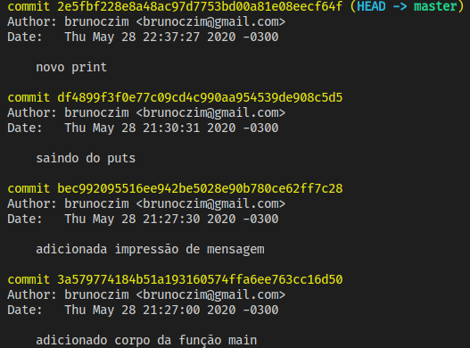
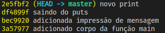
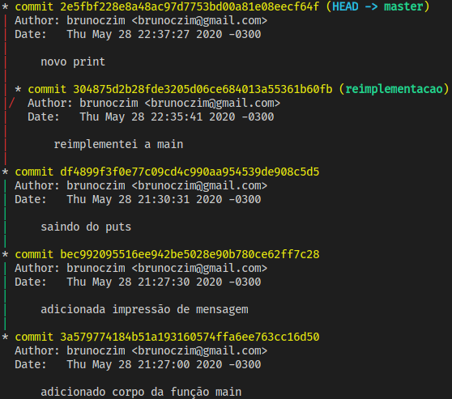

# `git log`

O comando `git log` permite visualizar o histórico do repositório. Sua forma
mais básica é:
```sh
git log
```

Para sair do comando, basta digitar `q`. Exemplo de visualização:


É possível compactar a formatação do comando:
```sh
git log --oneline
```


Por padrão, o `git log` só exibe conteúdo da _branch_ atual. Para mostrar outras
_branches_, a _flag_ `--all` é necessária. Além disso, faz sentido visualizar o
grafo das _branches_ neste caso, com a _flag_ `--graph`:
```sh
git log --all --graph
```

