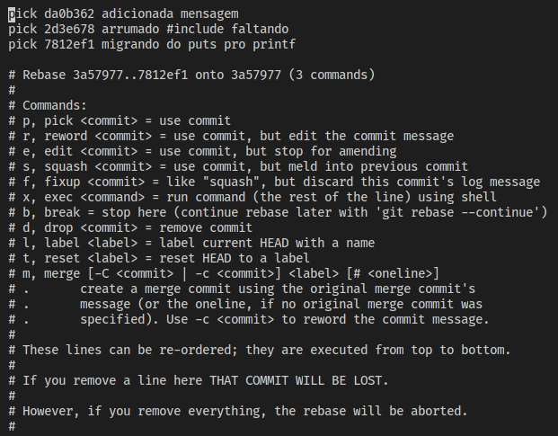
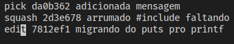
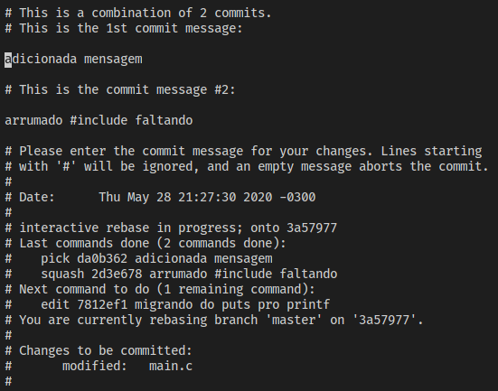

# `git rebase`

Além do _merge_, é possível mover ou editar seus commits. O comando `git rebase`
permite isso. Há dois tipos de `rebase`: o interativo e o não-interativo.

# _Rebase_ Não-Interativo

Um _rebase_ não-interativo "desloca" os _commits_ de uma _branch_ para de tal
forma que os _commits_ de outra branch façam parte da história desta _branch_,
preservando o conteúdo dos arquivos da primeira _branch_. Por exemplo, imagine o
seguinte cenário:
```
master    teste
80ba4e4  b49a7ed <- HEAD
   |        |
   |     4b12d0a
   |    /
   |   /
ec49a96
   |
3c97506
```

Agora, suponha que queremos "fingir" que a _branch_ começa no _commit_ `80ba4e4`
e não no _commit_ `ec49a96`. Basta executarmos o seguinte:
```sh
git rebase master teste
```

O Resultado é:
```
          teste
         b49a7ed <- HEAD
            |
         4b12d0a
        /
master /
80ba4e4
   |
ec49a96
   |
3c97506
```

# _Rebase_ Interativo

Para iniciar um _rebase_ interativo desde 3 _commits_ atrás, basta executar:
```sh
git rebase -i HEAD~3
```

Isso abrirá um editor de texto (No Linux, o padrão é o `vi`) para escolher como
você vai editar os _commits_. Você deve ver no editor um conteúdo similar a
esse:



A imagem por si só é bem descritiva. Note que você pode alterar a ordem também,
como no _rebase_ não-interativo. Mas como exemplo, tomemos a seguinte edição,
onde juntaremos os dois primeiros _commits_ em um (_squash_) e editaremos a
mensagem do terceiro.



Ao salvarmos e saírmos do editor, seremos requisitados para fornecer a mensagem
dos _commits_ que serão fundidos.



Basta editar a área que não está comentada (isto é, que não inicia com "`#`"),
e sair do editor.


Depois, precisamos editar a mensagem terceiro _commit_ do _rebase_. Para isso,
basta executar:
```sh
git commit --amend
```

E um editor irá abrir para inserirmos a mensagem. Ele virá com a mensagem
antiga, mas basta editar o texto de forma semelhante ao _squash_.

Para seguir em frente da edição do _commit_, basta executar:
```sh
git rebase --continue
```

Se em algum momento você quiser abortar o _rebase_, execute:
```sh
git rebase --abort
```
