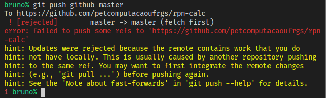
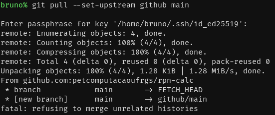
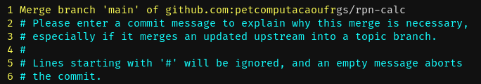

# Implementando Uma Pilha

Como o nosso avaliador de expressões precisa de uma pilha para avaliar as
expressões, vamos primeiro implementar uma pilha.

# Cabeçalho C

Agora vamos fazer um cabeçalho da linguagem C. Nossa pilha vai guardar `double`,
já que é o que a calculadora precisa. Vamos declarar duas funções básicas de
pilhas: `push` e `pop`, além de uma função para liberar memória. Elas vão
receber um ponteiro duplo, mas não se assuste, o ponteiro de dentro representa a
pilha em si, que pode ser `NULL`, e o ponteiro de fora serve para modificarmos o
endereço do ponteiro de dentro, e não pode ser `NULL`.

Arquivo `stack.h`:
```C
#ifndef STACK_H
#define STACK_H

typedef double stack_data;

struct stack {
    stack_data data;
    struct stack *next;
};

void stack_push(struct stack **stack, stack_data data);

int stack_pop(struct stack **stack, stack_data *data);

void stack_free(struct stack **stack);

#endif
```

Agora, vamos salvar nossa ideia de pilha em um _commit_.

```sh
git add .
git status
git commit -m 'ideia de stack adicionada'
```

Mas hmmmm, talvez fosse interessante salvar esse projeto em um serviço como o
GitHub. Por isso, eu criei um repositório remoto com a URL
<https://github.com/petcomputacaoufrgs/rpn-calc>. No repositório do GitHub, já
tem uma licença e um arquivo de `README`. Se você utilizar um remoto, lembre de
substituir a URL por uma adequada. Vamos salvar esse remoto:

```sh
git remote add github git@github.com:petcomputacaoufrgs/rpn-calc.git
```

Note que eu estou usando um endereço SSH, mas você poderia usar um endereço
HTTPS como `https://github.com/petcomputacaoufrgs/rpn-calc.git`.

Como o GitHub usa `main` como _branch_ principal, precisamos renomear `master`:
```
git branch -m main
```

Agora vamos executar um `push`, passando a _flag_ `-u`, e assim só vamos
precisar especificar o repositório remoto e a _branch_ uma vez para essa
_branch_:

```sh
git push -u github main
```



Oopsss... Eu criei o repositório remoto com licença e `README`. Primeiro vamos
ter que executar `git pull`. Precisamos usar a _flag_ `--set-upstream` para
porque o `push -u` falhou (`-u` e `--set-upstream` são equivalentes).

```sh
git pull --set-upstream github main
```



Oopsssss... Esse erro aconteceu porque as histórias dos repositórios não
têm conexão. Basta usar a _flag_ `--allow-unrelated-histories`.

```sh
git pull --allow-unrelated-histories
```

Então, abrir-se-á um editor de texto perguntando por uma mensagem de
_commit_. Basta editar, salvar, e sair.



Pronto, agora podemos executar `git push` tranquilamente.
```sh
git push
```

# Arquivo de Implementação C

Agora, vamos implementar a pilha.

Arquivo `stack.c`:

```C
#include "stack.h"
#include <stdlib.h>

void stack_push(struct stack **stack, stack_data data)
{
    struct stack *new_node = malloc(sizeof(struct stack));

    if (new_node == NULL) {
        abort();
    }

    new_node->data = data;
    new_node->next = *stack;
    *stack = new_node;
}

int stack_pop(struct stack **stack, stack_data *data)
{
    int success = 0;
    struct stack *node_ptr = *stack;

    if (node_ptr != NULL) {
        success = 1;
        *stack = node_ptr->next;
 
        if (data != NULL) {
            *data = node_ptr->data;
        }

        free(node_ptr);
    }

    return success;
}

void stack_free(struct stack **stack)
{
    while (stack_pop(stack, NULL)) {}
}
```

Vamos ver se não ocorre algum erro de compilação (no Linux):
```sh
gcc -o stack.o -c stack.c
```
Perfeito, não ocorre.

Agora vamos fazer um _commit_.
```sh
git add .
git status
git commit -m 'implementação da stack'
```

E publicar a mudança:
```sh
git push
```
