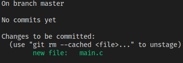

# Juntando tudo

Então, como usar estes comandos em conjunto? O fluxo normal é `git add` =>
`git status` => `git commit`. Eis um exemplo. Primeiro criaremos o projeto:
```sh
mkdir projeto
cd projeto
git init
```

Agora, introduziremos um arquivo main.c:
```c
int main()
{
    return 0;
}
```

E vamos tornar nosso novo arquivo _staged_:
```sh
git add main.c
```

Vamos olhar o que estamos introduzindo:
```sh
git status
```


Pronto! Podemos fazer o nosso primeiro _commit_.
```sh
git commit -m 'adicionada a função principal'
```
